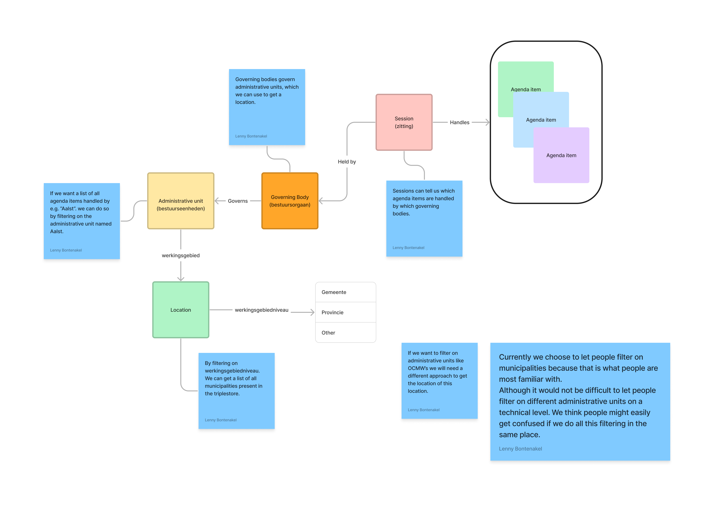

# Data Monitoring (front-end)

The front-end for DM, a web application which will inform local government respresentatives, software vendors and ABB (the agency) about the quality of the data published by local governments.

This is a work in progress.

## Tutorial: Getting Started

### Prerequisites

- [Node.js](https://nodejs.org/) v10 or later
- [Ember CLI](https://www.npmjs.com/package/ember-cli) v3.15 or later

### Installation

```bash
git clone https://github.com/lblod/frontend-data-monitoring
cd frontend-data-monitoring
npm install
```

From there, you can use `npm run dev:proxy`, or any of the following npm scripts:

| npm run...           | Description                                                                                                                                                                      |
| -------------------- | -------------------------------------------------------------------------------------------------------------------------------------------------------------------------------- |
| build                | Creates a production-ready static build                                                                                                                                          |
| build:analyze-bundle | Creates a production-ready static build and outputs some [extra bundle information](https://github.com/embroider-build/embroider/blob/main/docs/analyzing.md#analyzing-bundles). |
| lint                 | Runs the linter and returns any errors/warnings. _Is run automatically before committing, cancelling the commit on error_                                                        |
| lint:fix             | Runs the linter, attempting to automatically fix any errors                                                                                                                      |
| dev                  | Run a development server with the mock api                                                                                                                                       |
| dev:proxy            | Run a development server with a proxy to [the external dev server](https://burgernabije-besluitendatabank-dev.s.redhost.be/)                                                     |
| start                | Run a development server with the mock api                                                                                                                                       |
| prod                 | Run a production server                                                                                                                                                          |
| test                 | Run the linter and then ember tests                                                                                                                                              |

### Automated builds

The project uses woodpecker to automate builds. The configuration files can be found in the `.woodpecker` folder. Builds are available [here](https://build.redpencil.io/lblod/frontend-data-monitoring/).

- Latest master build : `lblod/frontend-data-monitoring:latest`
- Feature branch build : `lblod/frontend-data-monitoring:feature-<branch-name>`
- Version tag build : `lblod/frontend-data-monitoring:<version-tag>` tag like v1.2.3 would be published as 1.2.3 (so the v is dropped)

### Release

The project uses [release-it](https://github.com/release-it/release-it) to automate releases. The configuration files can be found in the `.release-it.json` file.

To enable the release process, it's crucial to set the GITHUB_AUTH environment variable, which requires a [personal access token](https://docs.github.com/en/github/authenticating-to-github/creating-a-personal-access-token) with the repo scope. This access token is necessary for creating and publishing releases on GitHub.

[CHANGELOG.md](CHANGELOG.md) is generated by [@release-it-plugins/lerna-changelog](https://github.com/release-it-plugins/lerna-changelog).
The changelog is constructed based on the labels applied to merged pull requests, specifically the enhancement and bug labels.

The release process is as follows:

1. Check the labels on recently merged pull requests
1. Checkout `master` branch
1. Run `npm run release` to initiate a new release
1. Follow instructions

## Reference

### Feature flags

Feature flags are used to enable/disable features in the application. They are defined in [config/environment.js](config/environment.js).

```javascript
// in config/environment.js
let ENV = {
  // Other configuration settings...
  features: {
    "new-feature": true, // Enable the 'new-feature' by default
    "beta-feature": false, // Disable the 'beta-feature' by default
  },
};
```

The configuration can be manually overridden by adding a query parameter to the URL:

- `?feature-new-feature=false` to disable the 'new-feature'
- `?feature-beta-feature=true` to enable the 'beta-feature'

The overriding will be saved in a cookie, so it will persist across page reloads. The cookie can be cleared by adding `?clear-feature-overrides=true` to the URL.

The feature flags can be used in the application by injecting the `features` service and calling the `isEnabled` method.

```javascript
import { inject as service } from "@ember/service";

export default class ExampleComponent extends Component {
  @service features;

  doSomething() {
    if (this.features.isEnabled("new-feature")) {
      // Implement the logic for the new feature
      console.log("New feature is enabled!");
    } else {
      // Implement the logic for the default behavior without the new feature
      console.log("New feature is disabled!");
    }
  }
}
```

Or in template files by using the `is-feature-enabled` helper:

```handlebars
{{#if (is-feature-enabled "new-feature")}}
  <p>New feature is enabled!</p>
{{else}}
  <p>New feature is disabled!</p>
{{/if}}
```

### List of feature flags

| Name                    | Description                                                      |
| ----------------------- | ---------------------------------------------------------------- |
| <nothing yet> | <nothing yet> |

### Environment variables

| Name              | Description                                                     |
| ----------------- | --------------------------------------------------------------- |
| PLAUSIBLE_APIHOST | The domain where the plausible.js can be found                  |
| PLAUSIBLE_DOMAIN  | The domain that has been configured to be tracked. If undefined |

### styles/ naming scheme

Ember works by outputting one big CSS file. This results in only needing one request for all styling (good for the end users) but also that every css you write for a route will always apply (ouch for the developers). To prevent duplicate ID's goofing things up and the .scss file becoming unreadable, The following structure has been set.

- [app.scss](app/styles/app.scss): File that will be output. HTML tag styling & imports are done here.
- [\_au-overrides.scss](app/styles/_au-overrides.scss): Overrides for appuniverse components
- [\_custom-classes.scss](app/styles/_custom-classes.scss): Custom classes that are meant to be used across the application
- [components/\_\*.scss](app/styles/components/)
  - One scss file per [component](app/components/)
  - Use the following selector structure `.component-COMPONENT-NAME` (make sure you use a class selector, as components may be reused on the same page)
- [routes/\_\*.scss](app/styles/routes/)
  - One scss file per [route](app/routes/)
  - Use the following selector structure `#route-ROUTE-NAME`
    - Use an ID, ideally applied to the top-most element of the route
    - For further SCSS rules that need to apply to this specific route, write them as follows:
      ```scss
      #route-ROUTE-NAME {
        .header {
          /* ... */
        }
        p {
          /* ... */
        }
      }
      ```
      This is to ensure it only applies to this route. If the styling should apply to multiple routes, it should be a [custom class](app/styles/_custom-classes.scss) or [element style](app/styles/app.scss) instead

## Discussions

### Data Alignment

Due to the intricacies of levels of Flemish bureaucratic units a data alignment meeting had to be planned.
The reason for this confusion was due to the levels of municipal governance in Flanders. After properly outlining the importance and nuance of each level it was decided that citizens should be able to see both the administrative unit.
The levels are as follows:

- Governing Body (Bestuursorgaan) (Algemene Vergadering Boom Plus)
- Administrative Unit (Bestuurseenheid) (Boom Plus)
- Location (Boom)



### Filtering

To help end users find what they're looking for, we allow filtering on agenda-items as well as sessions in the following ways:

- [Filter on municipality](#municipality)
- [Filter on keyword (\*)](#keyword)
- [Filter on date](#date)

_\*: only agenda-items_

These filters are powered by two important moving parts

1. [mu-cl-resources](https://github.com/mu-semtech/mu-cl-resources): this is the JSON:API our [back-end uses](https://github.com/lblod/app-burgernabije-besluitendatabank) (because JSON:API leaves some freedom of implementation, mentioning this is important! There are a few features and quirks that come from mu-cl-resources itself)
2. [Ember-Data](https://guides.emberjs.com/release/models/): this is the JSON:API-to-JavaScript our front-end uses

#### Default filters

The following filters are on by default for both agenda-items and sessions:

- `session:has:governing-body` == true
- `session.governing-body:has:administrative-unit` == true
- `session.governing-body.administrative-unit:has:name` == true

#### Municipality

So, the filter we present offers to filter on municipality. This is kind of a lie. Or well, it works different in the back-end.

We chose not to allow filtering on which entity made the decision. While this would allow specific filtering (e.g. "OCMW X" or "Police Y"), this would also:

- Create a gigantic select options list
- Make the general use case of "I want to know what is happening in my city" tedious to achieve

Instead, we check `(agenda-item.) session.governing-body.administrative-unit.location`. Our [municipality-list service](app/services/municipality-list.ts) queries all locations on the gemeente/municipality level, and we keep their label/name as well as their id.

This id allows us to use mu-cl-resources' `:id:` helper, which makes searching on one location as easy as multiple

- Single: `(agenda-item.) session.governing-body.administrative-unit.location:id:=ID`
- Multiple: `(agenda-item.) session.governing-body.administrative-unit.location:id:=ID1,ID2,ID3` (\*)

_\*Note: the `:id:` helper is an or selector, not and_

#### Keyword

This is a very simple one! This uses mu-cl-resources' `:or:` helper to check if `agenda-items.title` or `agenda-items.description` features the typed keyword.

#### Date

This uses the mu-cl-resources' `:gt:` and `:lt:` helpers (greater than and less than respectively). An agenda-item or session is returned if...

**Agenda-items:**

- The first selected date is _after_ (gt) `agenda-item.session.started-at`
- The second selected date is _before_ (lt) `agenda-item.session.ended-at`

This will return agenda-items with sessions that have been finished.

**Sessions:**

- The first selected date is _after_ (gt) `session.planned-start`
- The second selected date is _before_ (lt) `session.planned-start`

This will return sessions that started between those two dates, whether they have been finished or not.

<details>
    <summary>Note: the information in this spoiler is for a possible future filter change</summary>

- The first selected date is _after_ (gt) `(agenda-item.) session.planned-start`
- The second selected date is _before_ (lt) `(agenda-item.) session.planned-start`

There is additionally a `session.started-at` and `session.ended-at` property, but these are only present when the session is in the past, which would give incomplete results.

</details>
